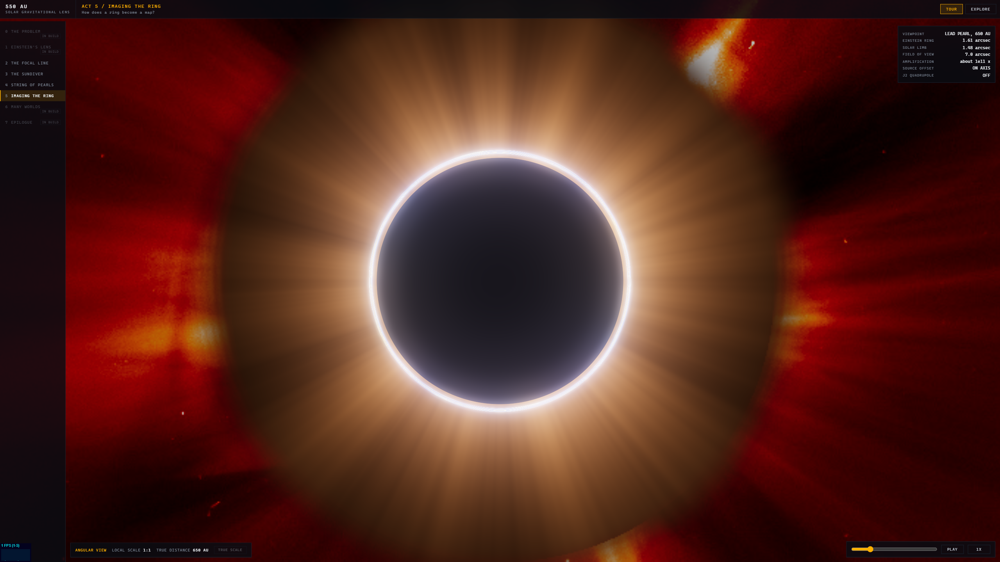
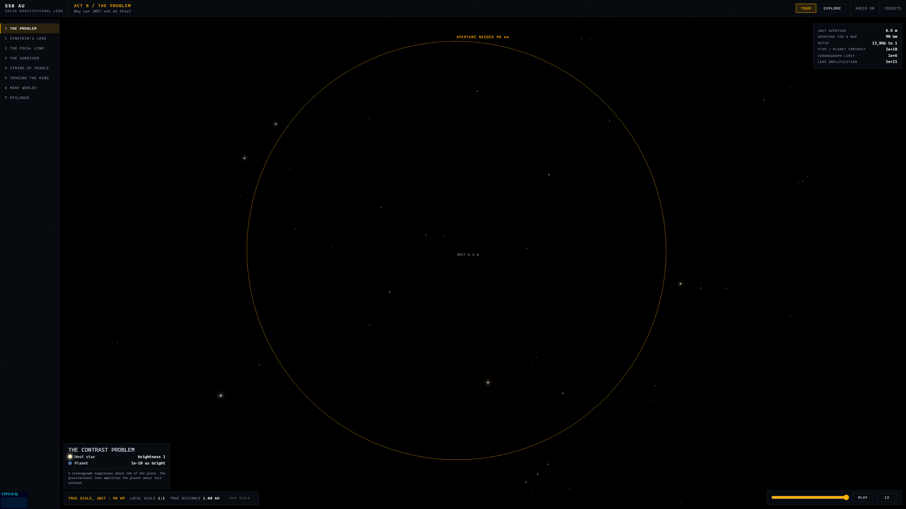
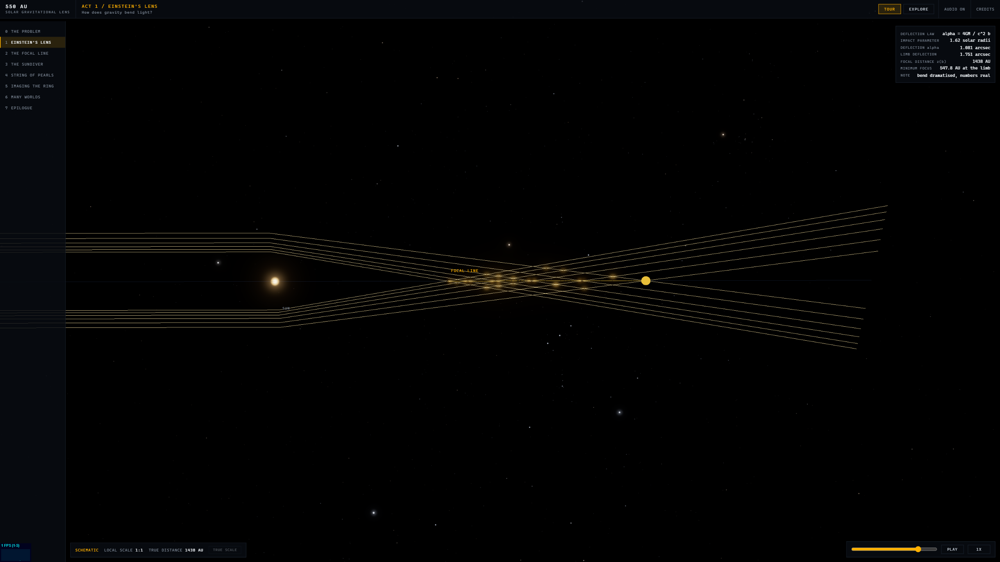
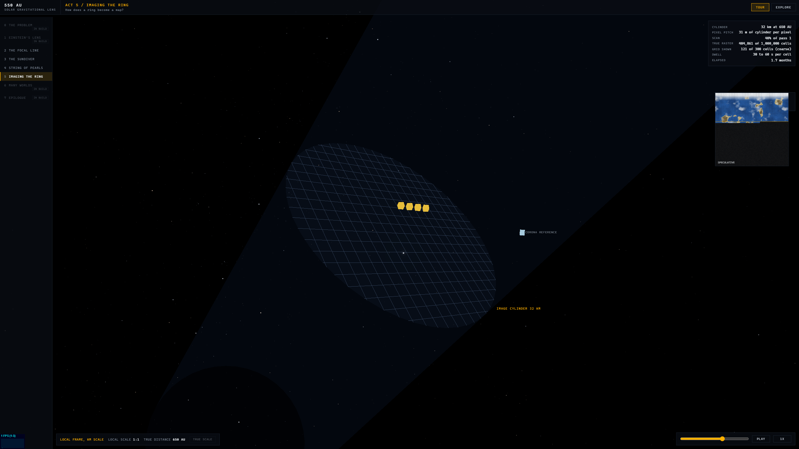
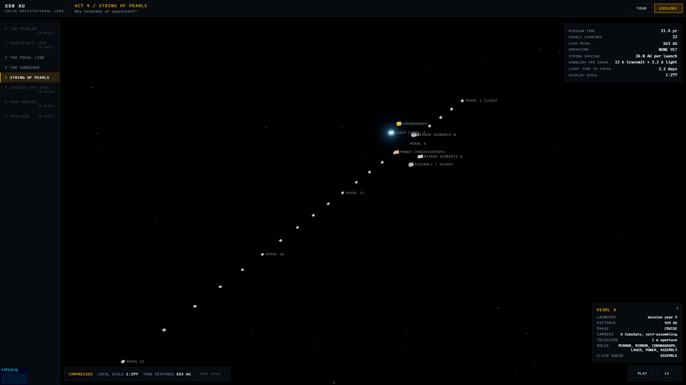
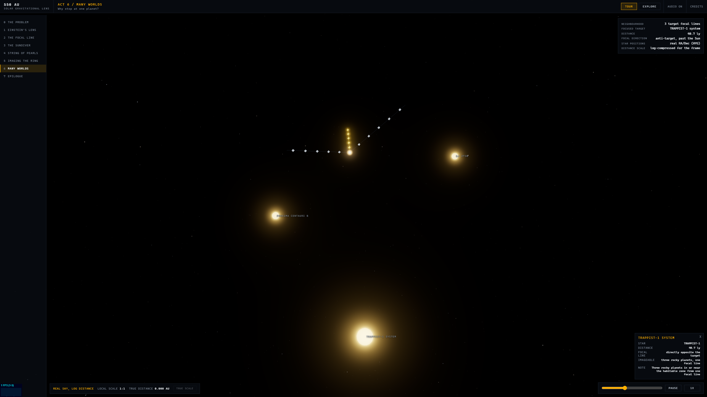
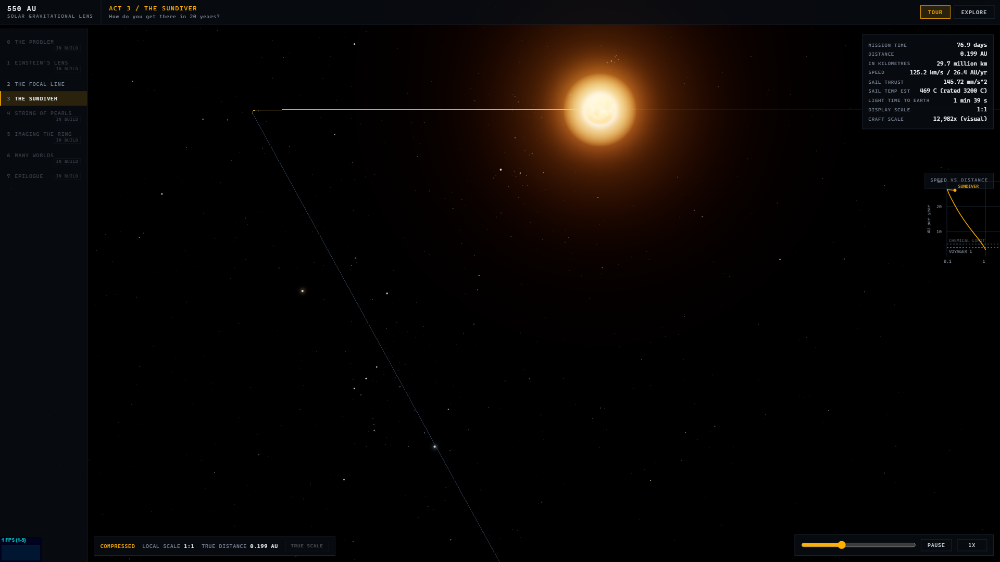
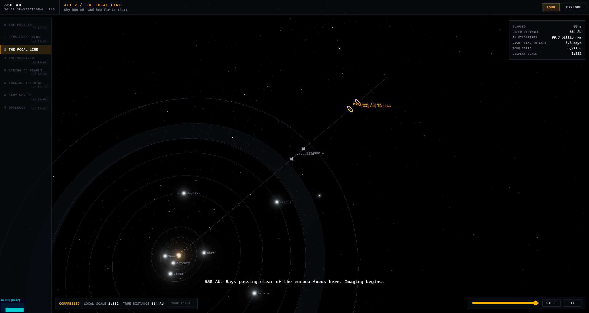

# 550 AU

[](LICENSE)


Interactive real-physics visualisation of the Solar Gravitational Lens Telescope (SGLT) mission concept: solar-sail swarms flying to 650+ AU to use the Sun as a gravitational lens and image an exoplanet's surface. Named for the minimum solar gravitational focal distance, 547.8 AU.

Status: **all eight acts complete (Tour and Explore), physics tests green, generative audio, credits overlay, honest-scale system with a true-scale toggle. GitHub Pages workflow is prepared but not enabled.**

Repo: `m4cd4r4/550-AU`.

















## Run it

```bash
npm install
npm run dev      # dev server
npm test         # physics test suite (vitest)
npm run build    # type-check + production build
```

The dev server also serves `/spike.html`: the standalone Act 5 lensing
spike, a permanent dev harness for the Einstein-ring shader with live
controls (heliocentric distance, source offset, J2 quadrupole, exposure).

Optional: `npm run fetch-assets` re-downloads and re-trims the bundled
assets (HYG star subset, Sun texture, LASCO C2 corona frame, and the NASA
JWST and Voyager render loupes). The repo already includes them.

## What it is

Eight acts, from "why JWST cannot image an exoplanet surface" to the
Einstein-ring imaging dance at 650 AU and the epilogue's lens-to-lens
internet. Each act has a Tour mode (scripted camera, captions) and an
Explore mode (free camera, clickable objects). A chapter rail switches
between them; global controls pause, scrub, and time-warp.

- **Act 0 - The Problem.** JWST at true 6.5 m scale beside the ghosted
  outline of the roughly 90 km aperture the same image would need by
  brute force, plus the contrast inset (a planet is about 1e10 times
  fainter than its star; a coronagraph buys about 1e6 of that).
- **Act 1 - Einstein's Lens.** Photon rays bending past the Sun,
  converging on the focal line that draws itself outward as impact
  parameter grows. The deflection is dramatised; alpha(b) and z(b) on
  the HUD are the true values.
- **Act 2 - The Focal Line.** A story-paced pullback from the Sun to the
  gravitational focus along a compressed ruler, with planet orbits, the
  Kuiper belt, the heliopause, Voyager 1, and the two lens milestones.
- **Act 3 - The Sundiver.** The integrated trajectory: sail deployment,
  perihelion slingshot at 0.1 AU, jettison at year 2, and a speed race
  against Voyager 1 and chemical propulsion.
- **Act 4 - The String of Pearls.** Yearly launches marching out at
  ~25 AU spacing, the pearl inspector (six CubeSats to a 1 m telescope),
  and the laser relay hopping images home.
- **Act 5 - Imaging the Ring.** The payoff: the live lensing shader at
  true angular scale, the 32 km image cylinder, the four-telescope raster
  dance with corona subtraction, and the map reconstructing pixel by pixel.
- **Act 6 - Many Worlds.** The real stellar neighbourhood, with focal
  lines radiating anti-target for Proxima b, TRAPPIST-1 and GJ 273b.
- **Act 7 - Epilogue.** The lens works both ways: a Sun-to-Alpha-Centauri
  comm link, then the Sagittarius A* thought experiment.

Honest-scale rules: distances may be compressed for comprehension, but the
scale ribbon always declares the mapping, the local compression factor and
the true distance, and Act 2's Explore mode offers a true-scale toggle
where the solar system shrinks to a dot 550 AU from the focal line. That
emptiness is the point.

Audio is generative: a warm, evolving WebAudio pad, a consonant chord of
pure-ratio voices with a slow filter drift, a synthetic reverb and sparse
chord-tone bells. It shifts colour per act. No sample files, so the repo
stays licence-clean. Muted state persists; audio starts only after a user
gesture, per browser autoplay policy.

In Tour mode the acts auto-advance: when one act's tour finishes it holds
briefly, then the show rolls on to the next (looping back at the end).
Explore mode, a chapter jump or a scrub hand control back. Two acts add a
circular loupe with a real NASA render (public domain): the James Webb
telescope in Act 0, and Voyager 1 and 2 in Act 4 as the pearl string
overtakes them.

## Physics model and what is dramatised

Every on-screen number comes from `src/data/mission-facts.json` or falls
out of the model in `src/sim/`, which is unit-tested (vitest) against these
anchors:

| Quantity | Equation | Anchor (test) |
|---|---|---|
| Light deflection | alpha = 4GM / (c^2 b) | 1.751 arcsec at the solar limb |
| Focal distance | z(b) = b^2 c^2 / 4GM | z(R_sun) = 547.8 AU |
| Einstein ring radius | theta_E = sqrt(4GM / (c^2 z)) | 1.61 arcsec at 650 AU (solar disc 1.48 arcsec) |
| Lens mapping (shader) | beta = theta - theta_E^2 theta / abs(theta)^2 + J2 quadrupole | ring radius = theta_E within 1%; two arcs off-axis |
| Sundiver trajectory | RK4: two-body + solar radiation pressure, face-on sail from perihelion | perihelion ~0.1 AU; exit 25-26 AU/yr; min focus in 19-22 yr |
| Pearl string | yearly launches on the shared trajectory | cruise spacing ~25 AU within 10% of the published figure |
| Image cylinder | D = D_planet x z / d_source | 32 km at 650 AU, 57 km at 1200 AU (Proxima b) |
| Planet positions | Kepler propagation, JPL approximate elements | Earth at 1 AU, closes orbit in 365.25 d |
| Star positions | HYG RA/Dec/distance | targets at their true sky directions |

### Appendix: which visuals are simulated vs dramatised

Simulated live, straight from the equations above:

- The Einstein ring and its off-axis arcs (Act 5 and the spike) are a
  fullscreen fragment shader inverting the thin-lens mapping per pixel; the
  GLSL is a transcription of the unit-tested `src/sim/lensing.ts`.
- The sundiver trajectory (Act 3) is a live RK4 integration; the pearl
  string (Act 4) is that same trajectory offset by each launch year.
- Ring radius, solar-limb radius, focal distances, image-cylinder diameter
  and pixel pitch are computed from the current heliocentric distance.
- Star and target directions (Acts 2, 6, 7) use real RA/Dec.

Dramatised, and labelled as such in-app:

- **Act 0** draws JWST and the 90 km ring to one true scale (the ratio,
  13,846 to 1, is the point), but the host star and planet in the contrast
  inset are schematic dots.
- **Act 1** exaggerates the deflection angle so the bend is visible at all
  (the true limb deflection is 1.75 arcsec, invisible at this zoom); the
  HUD carries the true alpha(b) and z(b), and the ribbon reads SCHEMATIC.
- **Act 3** draws the spacecraft far above true scale (a metre-class craft
  is sub-pixel at these distances); the HUD declares the factor and marks
  it NOT TO SCALE once only the bus remains. The sail lightness number is a
  tuned effective parameter (recorded in `mission-facts.json`), because the
  published exit speed exceeds what the quoted sail loading gives
  physically. The published timeline figures are quoted as claims; the
  integrator's own timeline is documented in a clarification appended to
  `docs/BUILD-PROMPT.md`.
- **Act 4** compresses the 25 AU pearl spacing for the frame; the ribbon
  declares the compression, and the true spacing is on the HUD. The laser
  pulse cadence is visual; the true 13 h transmit and 3.2 day light lag are
  on the HUD and captions.
- **Act 5** exaggerates the source-planet angular size and the J2 caustic
  strength for visibility (both stated on the HUD), draws the imaging grid
  far coarser than the true 1000 x 1000 raster (declared), and reconstructs
  the map as a progressive reveal standing in for the deconvolution. The
  planet surface is procedural and watermarked speculative throughout.
- **Act 6** log-compresses the light-year distances so all three targets
  fit one frame; the directions are real and the ribbon says so.
- **Act 7** is schematic: the comm link and the Sagittarius A* scene carry
  the real figures on cards, with the black hole flagged as a thought
  experiment beyond current engineering.

## Architecture notes

- Vite + TypeScript strict + Three.js, no UI framework. Vitest for physics.
- World positions are double-precision AU on the CPU; rendering is
  camera-relative (floating origin), so only small float coordinates reach
  the GPU. The scene spans 0.1 to 1200 AU.
- Star positions are real: the bundled HYG subset (8,922 stars to mag 6.5
  plus the mission targets) renders at true RA/Dec, so each target's focal
  line points anti-target against the real sky.
- One controller per act implements a small `Act` interface; `main.ts`
  routes between them and owns the shared renderer, Sun, starfield, HUD and
  audio.

## Sources

- AstroKobi, ["NASA's $40 BILLION Plan To Image Alien Worlds"](https://www.youtube.com/watch?v=go-50Dpzs20) - the video that surfaced this mission concept and shaped which facts and story beats to research. No narration was reproduced; all copy in this app is original (see the IP note in `docs/SIM-PLAN.md`)
- Turyshev et al 2020, NIAC Phase III report, [arXiv:2002.11871](https://arxiv.org/abs/2002.11871)
- Turyshev and Andersson 2002, [arXiv:gr-qc/0205126](https://arxiv.org/abs/gr-qc/0205126)
- FOCAL mission heritage (Maccone, Eshleman)
- NASA MMS formation-flying results
- Plan and build contract: `docs/SIM-PLAN.md`, `docs/BUILD-PROMPT.md`

Asset licences: see [CREDITS.md](CREDITS.md). The HYG database is
CC BY-SA 4.0 (David Nash, astronexus).
