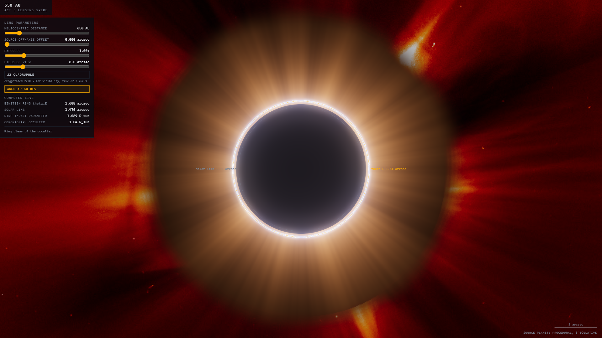
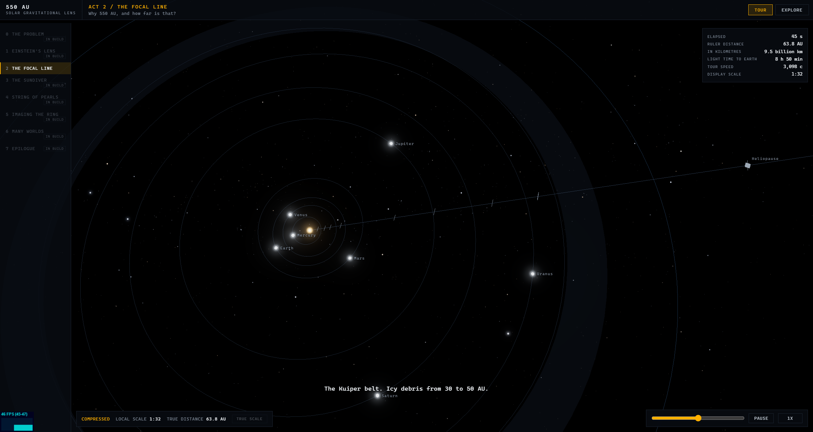

# 550 AU

Interactive real-physics visualisation of the Solar Gravitational Lens Telescope (SGLT) mission concept: solar-sail swarms flying to 650+ AU to use the Sun as a gravitational lens and image an exoplanet's surface. Named for the minimum solar gravitational focal distance, 547.8 AU.

Status: **in build. Slices 1-4 of 6 complete: app shell, physics core, Act 2 (The Focal Line), Act 5 lensing-shader spike, Act 3 (The Sundiver), Act 4 (String of Pearls).**

Open source (MIT). Repo: `m4cd4r4/550-AU`.







## Run it

```bash
npm install
npm run dev      # dev server
npm test         # physics test suite (vitest)
npm run build    # type-check + production build
```

The dev server also serves `/spike.html`: the standalone Act 5 lensing
spike, a permanent dev harness for the Einstein-ring shader with live
controls (heliocentric distance, source offset, J2 quadrupole, exposure).

Optional: `npm run fetch-assets` re-downloads and re-trims the bundled
assets (HYG star subset, Sun texture, LASCO C2 corona frame). The repo
already includes them.

## What it is

Eight acts, from "why JWST cannot image an exoplanet surface" to the
Einstein-ring imaging dance at 650 AU. Each act has a Tour mode (scripted
camera, captions) and an Explore mode (free camera, clickable objects).
Act 2 ships in this slice: a story-paced pullback from the Sun to the
gravitational focus along a compressed ruler, with planet orbits, the
Kuiper belt, the heliopause, Voyager 1, and the two lens milestones.

Honest-scale rules: distances may be compressed for comprehension, but the
scale ribbon always declares the mapping, the local compression factor and
the true distance, and Explore mode offers a true-scale toggle where the
solar system shrinks to a dot 550 AU from the focal line. That emptiness
is the point.

## Physics model (implemented so far)

All quantities on screen come from `src/data/mission-facts.json` or fall
out of the model in `src/sim/`, which is unit-tested against these anchors:

| Quantity | Equation | Anchor (test) |
|---|---|---|
| Light deflection | alpha = 4GM / (c^2 b) | 1.751 arcsec at the solar limb |
| Focal distance | z(b) = b^2 c^2 / 4GM | z(R_sun) = 547.8 AU |
| Einstein ring radius | theta_E = sqrt(4GM / (c^2 z)) | 1.61 arcsec at 650 AU (solar disc 1.48 arcsec) |
| Lens mapping (shader) | beta = theta - theta_E^2 theta / abs(theta)^2 + J2 quadrupole | ring radius = theta_E within 1%; two arcs off-axis |
| Sundiver trajectory | RK4: two-body + SRP, face-on sail from perihelion | perihelion ~0.1 AU; exit 25-26 AU/yr; min focus in 19-22 yr |
| Pearl string | yearly launches on the shared trajectory | cruise spacing ~25 AU within 10% of the published figure |
| Image cylinder | D = D_planet x z / d_source | 32 km at 650 AU, 57 km at 1200 AU (Proxima b) |
| Planet positions | Kepler propagation, JPL approximate elements | Earth at 1 AU, closes orbit in 365.25 d |

Dramatised (labelled in-app when shown): on the spike page the source
planet size and the J2 strength are exaggerated for visibility and the
panel says so; the planet surface is procedural and watermarked
speculative. The ruler compression in Act 2 is declared on the scale
ribbon at all times. In Act 3 the spacecraft is drawn above true scale
and the HUD declares the factor; the sail lightness number is a tuned
effective parameter (recorded in mission-facts.json), because the
published exit speed exceeds what the quoted sail loading gives
physically. The published timeline figures are quoted as claims; the
integrator's own timeline is documented in a clarification appended to
docs/BUILD-PROMPT.md.

## Architecture notes

- Vite + TypeScript strict + Three.js, no UI framework. Vitest for physics.
- World positions are double-precision AU on the CPU; rendering is
  camera-relative (floating origin), so only small float coordinates reach
  the GPU. The scene spans 0.1 to 1200 AU.
- Star positions are real: the bundled HYG subset (8,922 stars to mag 6.5
  plus the mission targets) renders at true RA/Dec, so each target's focal
  line points anti-target against the real sky.

## Sources

- Turyshev et al 2020, NIAC Phase III report, [arXiv:2002.11871](https://arxiv.org/abs/2002.11871)
- Turyshev and Andersson 2002, [arXiv:gr-qc/0205126](https://arxiv.org/abs/gr-qc/0205126)
- FOCAL mission heritage (Maccone, Eshleman)
- NASA MMS formation-flying results
- Plan and build contract: `docs/SIM-PLAN.md`, `docs/BUILD-PROMPT.md`

Asset licences: see [CREDITS.md](CREDITS.md). The HYG database is
CC BY-SA 4.0 (David Nash, astronexus).
